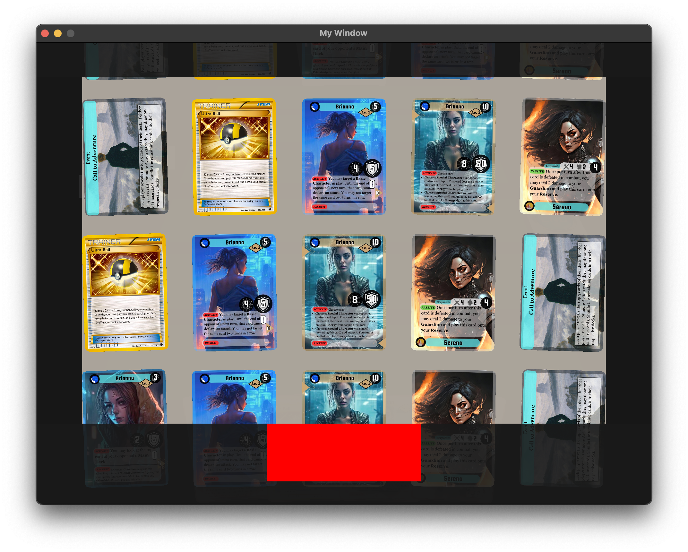

### What is this?

This is a basic game engine specifically for card games. In essence, I wanted to learn OpenGL and half of the ideas in my "Software Ideas" notes are card games, so I decided to start on my own game engine for it. This isn't meant to work as a game out of the box, this is only meant as a rendering engine for card games. The stuff in the `example` directory serves as an example for what a user would write and customize, and that same directory is used for my own development. The assets used in the example directory are composed of artwork which I do not own in any way, and the card text/outline which was made by myself and my sister for our own entertainment several years ago. None of the assets are intended as a part of this application but as merely in this project repository for the sake of easily testing the application.

Right now, the application is very bare-bones. The application opens to a main menu which is just an single button that brings you to the game screen. Then the game doesn't start until a corresponding server tells it to (and that another player has requesting to begin). Such a server can be found [here](https://github.com/Zarone/CardGameServer).

### TODO:
- Dynamically handle game actions on example server
  - mark some card groups as public (i.e. the opponent can see them) and make movement to a public card group share the CardID as well as the GameID so that the card can be rendered by all players.
  - open the right view on ultra ball
  - activate effects of cards in play. Cards with activate effects will give the yellow glow, and when you click them it will poll the server for legal actions and display them in the command palette.
- Handle End Turn Button
- Make command palette visible on expandedView
- Ask user heads/tail and then first/second
- Display the current phase
- Be able to render tokens onto cards (i.e poison, burn in pokémon card game)
- Add visible scroll bar for expanded view
- Right click to expand view of single card
- Move ProcessClick and ProcessScroll from the testGameState
  - Everything in the example directory should be specific to the card game being implemented, not a part of the engine. So the ProcessClick and ProcessScroll should be abstracted, perhaps with some event handler creator for all inner sceneObjects
- Proper startup screen in example directory
- Object file loading

### Build
- Install CMake
- Install GLEW onto your system so that CMake can find it.
- On Mac/Linux
  - `cd build`
  - `cmake ..`
  - `make`
  - `./GraphicsEngine`
- On Windows
  - `cd build`
  - `cmake ..`
  - Open project in Visual Studio

### Use
  - Meant to be ran alongside a server like the one [here](https://github.com/Zarone/CardGameServer)
  - Meant to be ran with two ongoing clients so that they can engage in a game "against each other" (i.e 2 player only)
