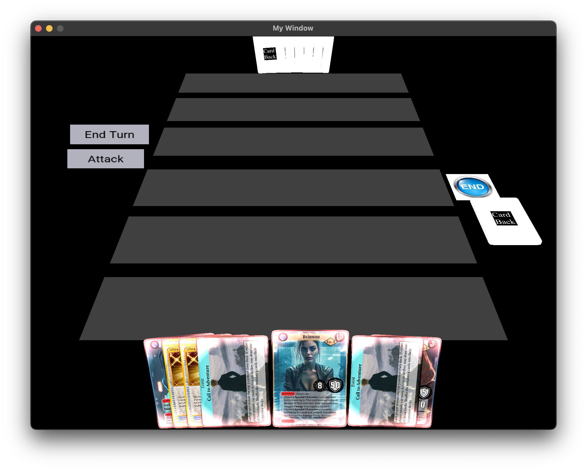

### What is this?

This is a basic game engine specifically for card games. In essence, I wanted to learn OpenGL and half of the ideas in my "Software Ideas" notes are card games, so I decided to start on my own game engine for it. This isn't meant to work as a game out of the box, this is only meant as a rendering engine for card games. The stuff in the `example` directory serves as an example for what a user would write and customize, and that same directory is used for my own development. The assets used in the example directory are composed of artwork which I do not own in any way, and the card text/outline which was made by myself and my sister for our own entertainment several years ago. None of the assets are intended as a part of this application but as merely in this project repository for the sake of easily testing the application.

Right now, the application is very barebones. The application opens to a main menu which is just an unlabeled red button which brings you to the game screen.

### TODO:
- Scrolling for expanded card view
- OnHover effect for expanded card view
- Proper startup screen in example directory
- Right click to expand view of single card
- Object file loading

### Build
- Install CMake
- Install GLEW onto your system so that CMake can find it.
- On Mac/Linux
  - `cd build`
  - `cmake ..`
  - `make`
- On Windows
  - `cd build`
  - `cmake ..`
  - Open project in Visual Studio
